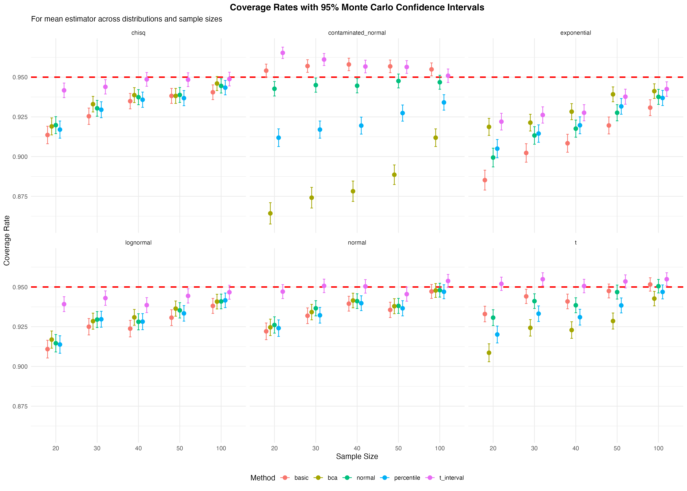
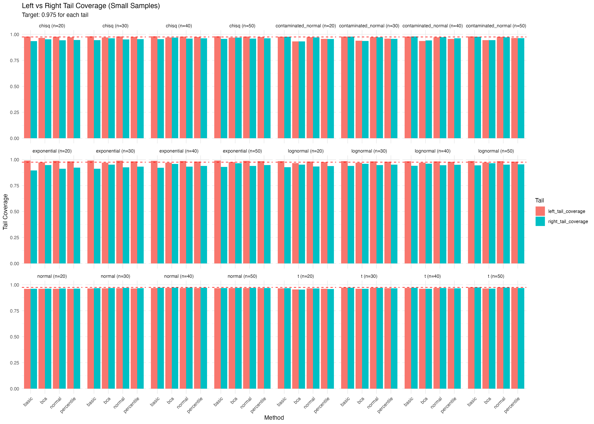

# Bootstrap Confidence Intervals for Small Samples

### A Comprehensive Monte Carlo Simulation Study

**Authors:** Bentum Welson & Asante Akosua Agnes  
**Institution:** Department of Statistics, Kwame Nkrumah University of Science and Technology, Ghana  
**Year:** 2025

---

## Abstract

While bootstrap methods offer robust alternatives to classical inference for small samples, comprehensive guidance on method selection remains limited. This Monte Carlo simulation study compares **four bootstrap confidence interval methods** (percentile, basic, normal approximation, and bias-corrected accelerated) across **132 scenarios with 10,000 replications each**.

**Key Finding:** For small samples (n≤50), the bias-corrected and accelerated (BCa) method achieved mean coverage of **0.9281** compared to 0.9261 for basic, 0.9274 for percentile, and 0.9296 for normal approximation. However, BCa required **76 times longer** computation time.

---

## Main Results

### Coverage Performance (Small Samples, n≤50)

| Method | Mean Coverage | SD Coverage | Mean Width |
|--------|---------------|-------------|------------|
| Normal | 0.9296 | 0.0119 | 2.125 |
| BCa | 0.9281 | 0.0099 | 2.183 |
| Percentile | 0.9274 | 0.0100 | 2.110 |
| Basic | 0.9261 | 0.0159 | 2.110 |

### Critical Findings

✅ **For Exponential Distribution (n=20):** BCa achieved 91.87% coverage while basic method only achieved 88.45% - a practically significant difference of 3.4 percentage points

✅ **Computational Cost:** BCa requires 17,052ms vs. normal approximation's 47ms (362× slower)

✅ **Practical Recommendation:** Use BCa for n<40 with skewed data; use normal approximation for n≥40 or when computational efficiency matters

---

## Repository Contents

```
bootstrap-confidence-intervals-small-samples/
├── README.md                                    # This file
├── BOOTSTRAP.pdf                                # Full research manuscript
├── bootstrap_simulation.R                       # Complete R simulation code
├── bootstrap_simulation_results.csv             # Main results (132 scenarios × 10,000 reps)
├── Table1_Coverage_Rates.csv                    # Coverage by method and distribution
├── Table2_Mean_Widths.csv                       # Mean interval widths
└── Table3_Small_Sample_Summary.csv              # Summary for n≤50
```

---

## Quick Start

### Requirements

- R version ≥ 4.3.1
- Required R packages: `boot`, `parallel`, `ggplot2`, `dplyr`, `tidyr`, `knitr`, `kableExtra`, `gridExtra`, `patchwork`, `pheatmap`, `viridis`, `MASS`, `microbenchmark`

### Installation

```r
# Install required packages
install.packages(c("boot", "parallel", "ggplot2", "dplyr", "tidyr",
                   "knitr", "kableExtra", "gridExtra", "patchwork",
                   "pheatmap", "viridis", "MASS", "microbenchmark"))
```

### Running the Code

```r
# Set seed for reproducibility
set.seed(23)

# Run the complete simulation (takes approximately 8-12 hours)
source("bootstrap_simulation.R")
```

### Quick Example

```r
library(boot)

# Example: Small pilot study data (n=25)
pilot_data <- c(22.3, 24.1, 19.8, 25.6, 21.2, 23.4, 20.9, 26.1, 22.8, 24.5,
                21.7, 23.9, 25.2, 20.4, 22.6, 24.8, 21.3, 23.1, 25.9, 22.4,
                24.3, 21.8, 23.5, 20.6, 25.4)

# Bootstrap the mean with BCa method (recommended for small n)
boot_result <- boot(pilot_data, function(x, i) mean(x[i]), R = 2000)
boot.ci(boot_result, type = "bca", conf = 0.95)
```

---

## Study Design

**Simulation Parameters:**
- Sample sizes: n = 20, 30, 40, 50, 100, 200
- Distributions: Normal, Chi-square(10), Exponential, t(5), Lognormal, Contaminated Normal
- Estimands: Mean, Median, Standard Deviation, Coefficient of Variation
- Monte Carlo replications: 10,000 per scenario
- Bootstrap samples: 1,000 per replication
- Total confidence intervals: 1,320,000

**Bootstrap Methods Compared:**
1. **Percentile** - Uses quantiles of bootstrap distribution directly
2. **Basic (Reverse Percentile)** - Reflects bootstrap percentiles around observed statistic
3. **Normal Approximation** - Uses bootstrap SE with normal quantiles
4. **BCa (Bias-Corrected and Accelerated)** - Second-order accurate method with bias and skewness correction

---

## Citation

If you use this code or findings in your research, please cite:

```
Welson, B., & Agnes, A. A. (2025). Bootstrap Confidence Intervals for Small Samples: 
A Comprehensive Monte Carlo Simulation Study. Department of Statistics, 
Kwame Nkrumah University of Science and Technology, Ghana.
```

**BibTeX:**
```bibtex
@article{welson2025bootstrap,
  title={Bootstrap Confidence Intervals for Small Samples: A Comprehensive Monte Carlo Simulation Study},
  author={Welson, Bentum and Agnes, Asante Akosua},
  year={2025},
  institution={Kwame Nkrumah University of Science and Technology},
  address={Ghana}
}
```

---

## Reproducibility

All results are **fully reproducible** using:
- Random seed: 23
- R version: 4.3.1
- Complete code provided in `bootstrap_simulation.R`

To reproduce our exact results:
```r
set.seed(23)
source("bootstrap_simulation.R")
```

---

## 📊 Key Visualizations

### Coverage Rates by Distribution and Sample Size


### Tail Coverage Analysis (Small Samples)


## Practical Recommendations

### Method Selection Guide

| Your Situation | Recommended Method | Why |
|----------------|-------------------|-----|
| n < 30, skewed distribution | **BCa** | Coverage 91.87% vs basic 88.45% for exponential |
| n < 30, heavy tails (outliers) | **Normal or Basic** | BCa unstable with extreme values |
| n = 30-39, any distribution | **BCa** | Best overall coverage (92.81%) |
| n = 40-49, symmetric data | **Normal** | Same coverage as BCa, 362× faster |
| n ≥ 50, any distribution | **Normal** | All methods converge; efficiency matters |
| Estimating median | **BCa or Percentile** | Basic fails (82-84% coverage) |
| Estimating SD or CV | **Use n ≥ 40** | All methods struggle at smaller n |
| Large study (>100 CIs) | **Normal** | Computational feasibility |

### General Guidelines

✓ Always use at least **B = 1000** bootstrap replications (2000 for BCa is better)  
✓ For n < 40, **check your data for skewness** before choosing a method  
✓ **Avoid basic and percentile methods** for small samples with skewed data  
✓ Report both **coverage performance and interval width** in your results  
✓ When in doubt with small samples and skewness, **choose BCa**

---

## Study Limitations

⚠️ **Standard Deviation and Coefficient of Variation:** All methods show poor coverage at n < 40  
⚠️ **Heavy Contamination:** BCa can be unreliable with extreme outliers  
⚠️ **Computation Time:** BCa requires significant time for large-scale studies  
⚠️ **Scope:** Results apply to univariate parameters only (not regression coefficients)

---

## 🤝 Contributing

We welcome contributions! Please:
1. Fork the repository
2. Create a feature branch (`git checkout -b feature/improvement`)
3. Commit changes (`git commit -am 'Add improvement'`)
4. Push to branch (`git push origin feature/improvement`)
5. Open a Pull Request

## Contact

**Bentum Welson** - bwelson523@gmail.com  
**Asante Akosua Agnes** - 
**Kwame Nkrumah University of Science and Technology

For questions about this research, please open an issue in this repository.

---

## 📝 License

This project is licensed under the MIT License - see the [LICENSE](LICENSE) file for details.

## Acknowledgments

We gratefully acknowledge:
- KNUST Department of Statistics for computational resources
- R Core Team and package developers (especially the `boot` package)
- All colleagues who provided feedback on this research

---

## License

This project is available for academic and research use. Please cite appropriately if you use this work.

---

**Keywords:** Bootstrap methods · Bias-corrected and accelerated · Small sample inference · Monte Carlo simulation · Confidence intervals · Coverage probability · R programming
